<picture>
  <source media="(prefers-color-scheme: dark)" srcset="assets/header-dark.svg">
  
</picture>

<picture>
  <source media="(prefers-color-scheme: dark)" srcset="assets/neofetch-dark.svg">
  
</picture>

I study Banking and Finance at NTU and want to work in buy-side equity research. Code is how I test ideas instead of taking a narrative on faith: when the market started calling the end of SaaS, I built apps from scratch with Claude Code to see how hard the hard parts really are. (The front end was easy. The back end was not, which is roughly my view on ServiceNow.)

<picture>
  <source media="(prefers-color-scheme: dark)" srcset="https://raw.githubusercontent.com/warrenlimzf/warrenlimzf/output/snake-dark.svg">
  
</picture>

<picture>
  <source media="(prefers-color-scheme: dark)" srcset="assets/projects-dark.svg">
  
</picture>

```console
warren@github:~$ ./links.sh
```

<p>
  <a href="https://warrenlimzf.com"></a>
  <a href="https://linkedin.com/in/warrenlimzf/"></a>
  <a href="https://github.com/warrenlimzf?tab=repositories"></a>
</p>

```console
warren@github:~$ cat stack.txt
```

<p>
  <a href="https://www.python.org"></a>
  <a href="https://www.typescriptlang.org"></a>
  <a href="https://nextjs.org"></a>
  <a href="https://vercel.com"></a>
  <a href="https://learn.microsoft.com/office/vba/api/overview/excel"></a>
  <a href="https://www.microsoft.com/power-platform/products/power-automate"></a>
  <a href="https://www.claude.com/product/claude-code"></a>
</p>

```console
warren@github:~$ ls ~/open-source
```

- [**pinnacle-invoice-automation**](https://github.com/warrenlimzf/pinnacle-invoice-automation): drop a private-bank statement PDF (LGT, Bank of Singapore, UBS) into a folder and get the NAV figures in Excel, each backed by a screenshot of where it came from. Runs fully on your own machine.
- [**pinnacle-invoice-automation-api**](https://github.com/warrenlimzf/pinnacle-invoice-automation-api): the same tool, reading scanned pages through an API in seconds instead of minutes.

<sub>Cards are SVGs generated by <code>build.py</code> (the portrait is ASCII from my headshot) and follow your GitHub light or dark theme. The snake redraws daily from my contribution graph.</sub>
